<h1 align="center">🚀 Job/Internship Application Tracker 🚀</h1>

<p align="center">
  A full-stack web application for tracking job and internship applications, interviews, and offers
</p>

<p align="center">
  This project demonstrates backend (Python/FastAPI), database (SQLite), and frontend (React) skills.
</p>

---

## 🌟 Key Features
- **Track Job and Internship Applications:** Company, role, industry, compensation, application date, last updated, status, type, and notes.
- **Create & Edit Jobs:** Intuitive modal form for adding and updating applications.
- **Dynamic Dashboard:** Spreadsheet-style view for easy management.
- **Theme Toggle:** Light/Dark modes for accessibility.
- **Responsive Design:** Desktop and mobile friendly.

---

## 📸 Screenshots

Below are screenshots demonstrating the main features of the Job/Internship Application Tracker.
You can view the dashboard with the seeded and custom data, as well as the various modals for creating and editing applications.
Click each section to expand and see the full set of images in both light and dark modes.

<details>
    <summary style="font-size:18px; font-weight:bold;">📊 Dashboard Screenshots</summary>

### Dashboard

**Seeded Data - Dark Mode**
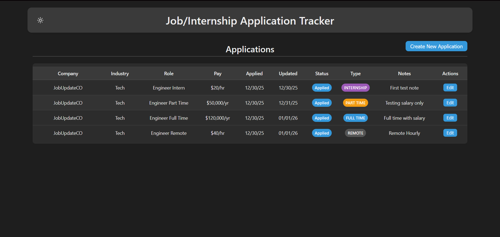

**Seeded Data - Light Mode**
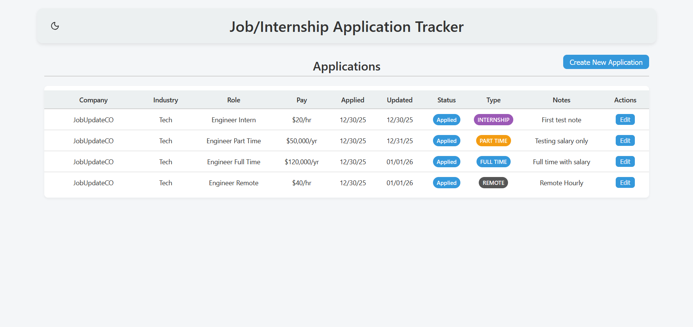

**Custom/New Application - Dark Mode**
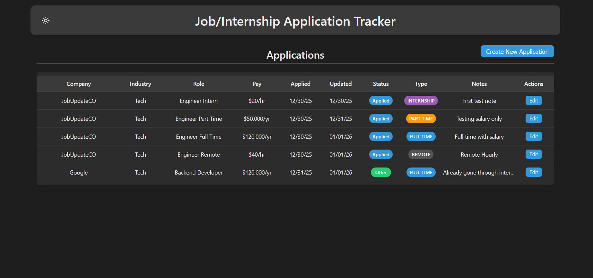

**Custom/New Application (with hover tooltip on long note) - Light Mode**
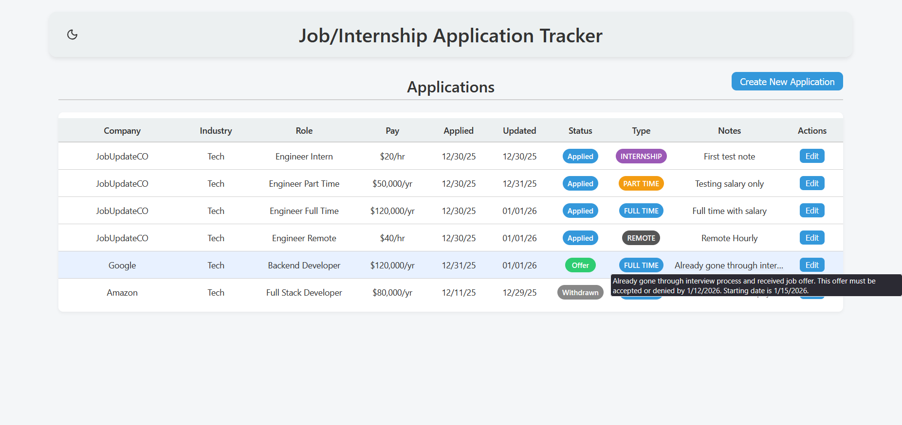

</details>

<details>
    <summary style="font-size:18px; font-weight:bold;">🖼️ Modal Screenshots</summary>

### Modals

*NOTE:* The "Job Type" dropdown previously displayed values in all caps (e.g., FULL TIME). It has been updated to display in title case (e.g., Full Time, Part Time) for improved readability.

**Create New Application Modal - Dark (Empty)**
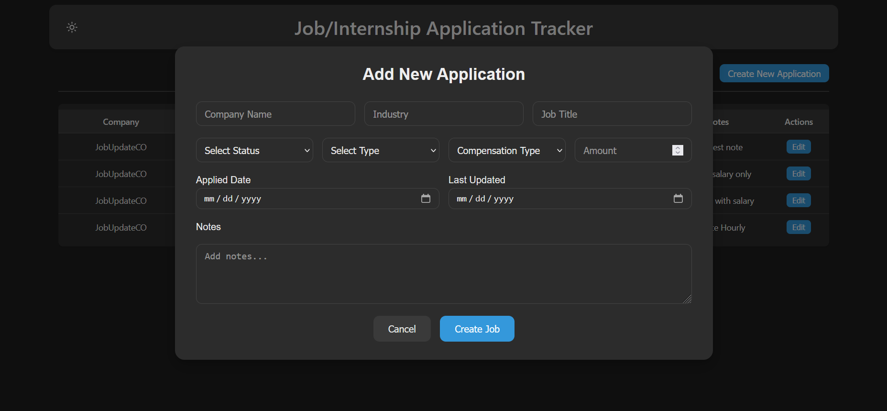

**Create New Application Modal - Dark (Filled)**
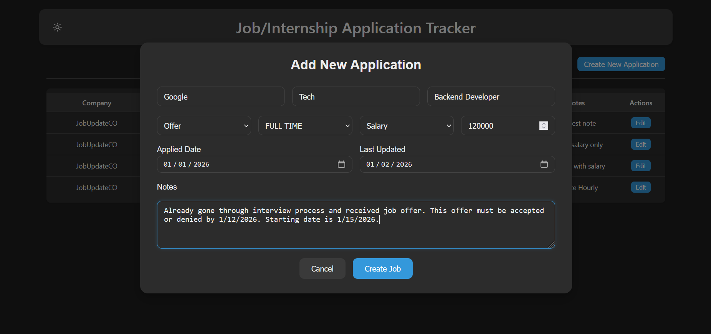

**Create New Application Modal - Light (Filled)**
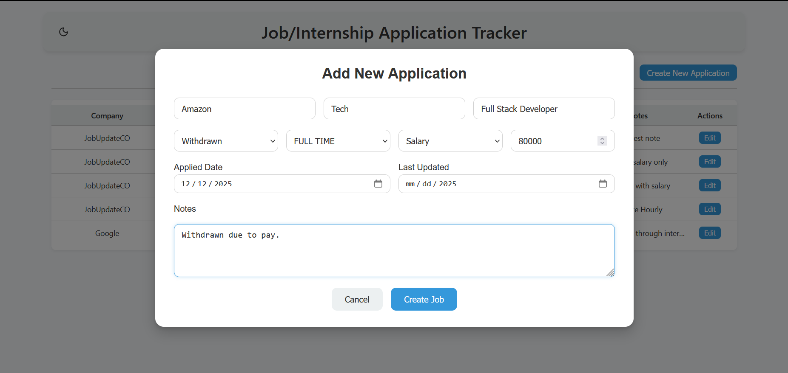

**Edit Application Modal - Dark**
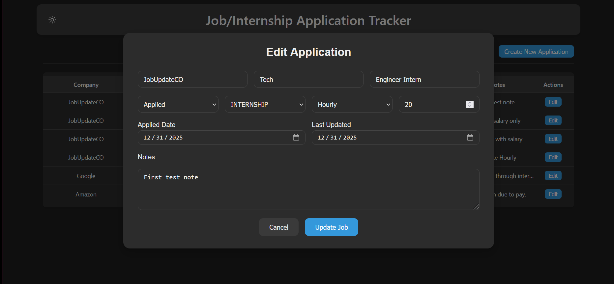

**Edit Application Modal - Light**
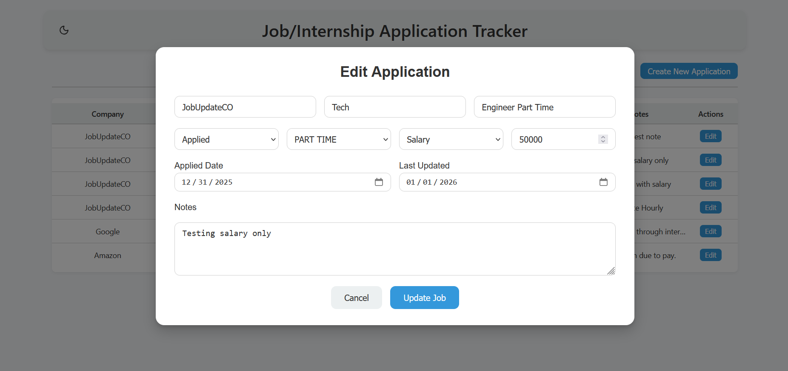

</details>

## 🗂 Project Structure
- `backend/` — The API and database logic (FastAPI + SQLite)
- `frontend/` — UI code (React)
- `styles/` — CSS for JobForm (Modal) component
- `.gitignore` — Files/folders to exclude from version control
- `README.md` — Project documentation

---

## 🧩 System Architecture (UML)

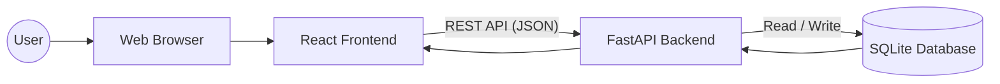

## 🗄 Database Scheme (Entity Relationship Diagram)

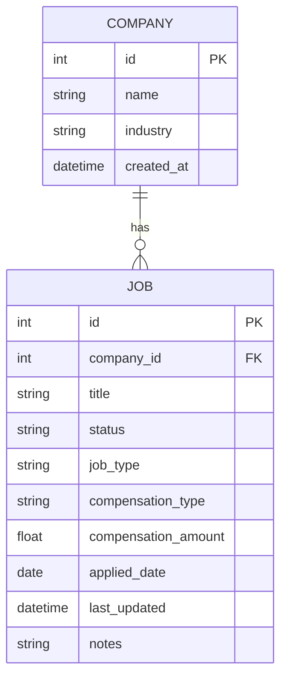

## 🛠 Technologies Used

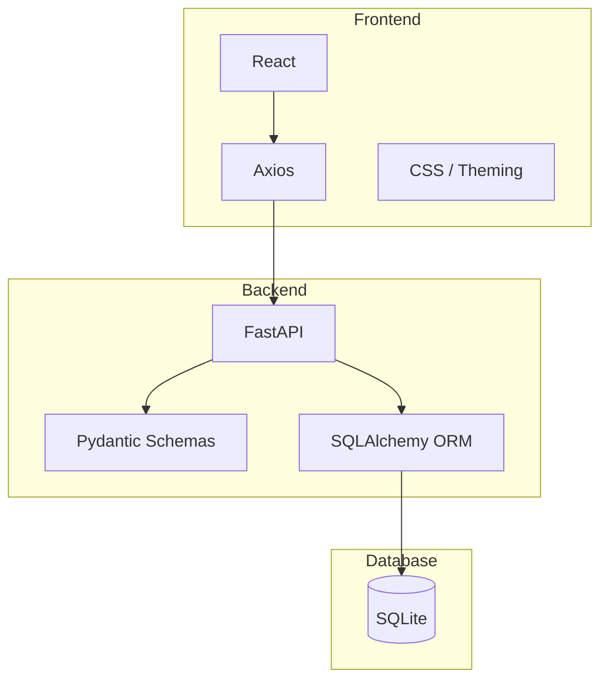

## Getting Started

### Prerequisites
- Python 3.13
- pip or virtual environment support
- SQLite (default database)

## Backend Setup
1. Go to the backend folder:
    ```bash
    cd backend
    ```
2. Create and activate a virtual environment:
    - Linux/macOS:
        ```bash
        python -m venv venv && source venv/bin/activate
        ```
    - Windows:
        ```bash
        python -m venv venv && venv\Scripts\activate
        ```
3. Install dependencies:
    ```bash
    pip install -r requirements.txt
    ```
4. Initialize the database (this will delete the existing data):
    ```bash
    python reset_db.py
    ```
5. Optionally, seed the database with example data:
    ```bash
    python seed_db.py
    ```
6. Start the API server:
    ```bash
    uvicorn app.main:app --reload
    ```
Access API:
- Base API URL: http://127/0.0.1:8000
- Swagger docs: http://127/0.0.1:8000/docs

## Frontend Setup
1. Go to the frontend folder
    ```bash
    cd frontend
    ```
2. Install dependencies:
    ```bash
    npm install # recommended
    # or
    yarn 
    ```
3. Start the development server:
    ```bash
    npm start # recommended
    # or
    yarn start
- The React app will open in your default browser at http://localhost:3000
- It communicates with the backend at http://127.0.0.1:8000 by default

### 🎯 Usage
- **Dashboard:** View all job applications.
- **Create New Application:** Click "Create New Application" → fill in modal form.
- **Edit Job:** Click edit icon in job row → update modal form.
- **Theme Toggle:** Click sun/moon icon to switch to light/dark mode.

*Notes:* Compensation displays as `/yr` for salary or `/hr` for hourly.

## 🔌 API Endpoints
### Companies
- `GET /api/companies` - Lists all companies
- `GET /api/companies/{id}` - Get a single company
- `POST /api/companies` - Create a new company
- `PUT /api/companies/{id}` - Update a company
- `DELETE /api/companies/{id}` - Delete a company

### Jobs
- `GET /api/jobs` - List all jobs
- `GET /api/jobs/{id}` - Get a single job
- `POST /api/jobs` - Create a new job
- `PUT /api/jobs/{id}` - Update a job
- `DELETE /api/jobs/{id}` - Delete a job

## 🧪 Testing
- Run tests using:
    ```bash
    pytest -v
    ```
- Test use an in-memory database, so they are safe to run anytime

### 📝 Notes
- `reset_db.py` deletes all existing data.
- `seed_db.py` adds example companies and jobs.
- FastAPI automatically generated interactive documentation at <code>/docs</code>

<p align="center">Made with ❤️ by Mack</p>