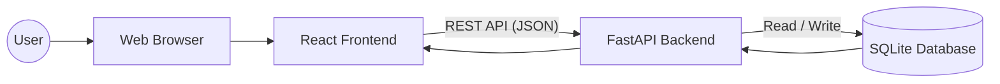
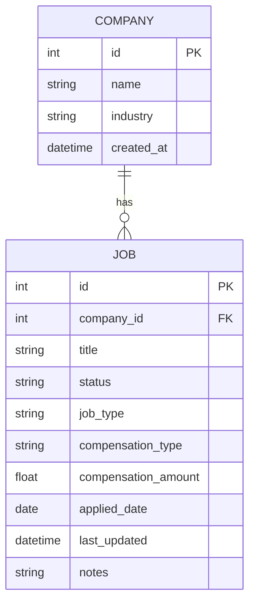
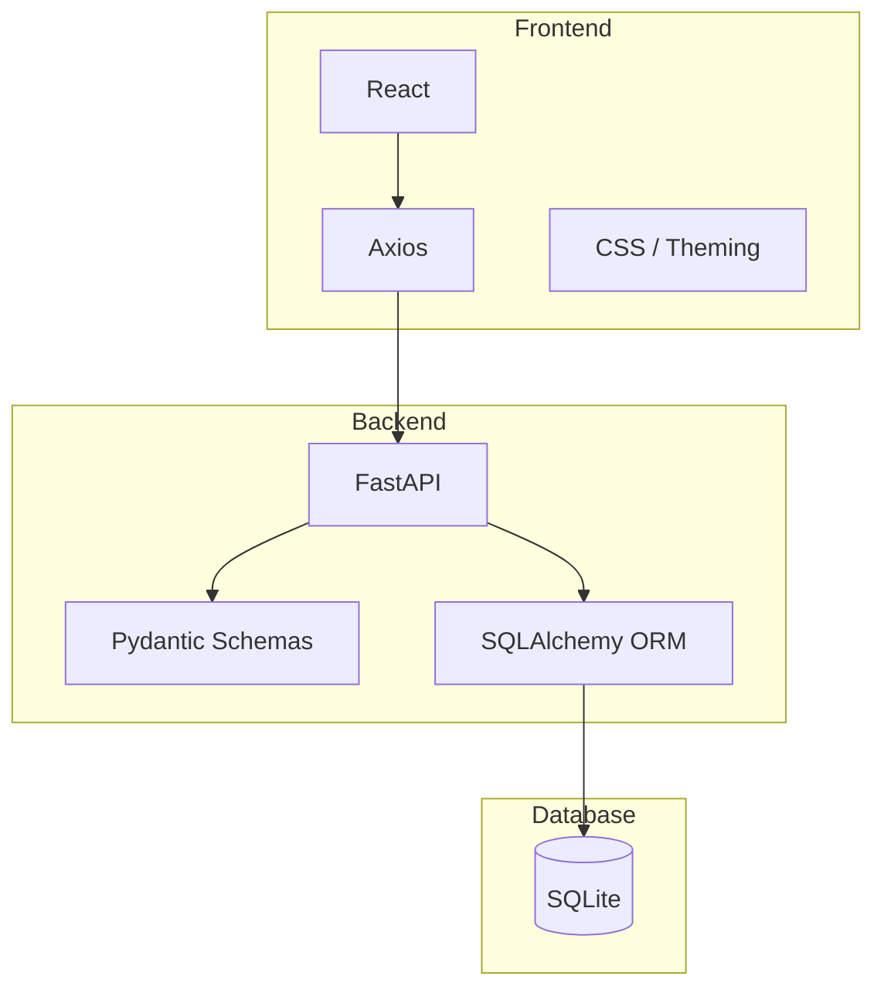

<h1 align="center">🚀 Job/Internship Application Tracker 🚀</h1>

<p align="center">
  A full-stack web application for tracking job and internship applications, interviews, and offers
</p>

<p align="center">
  This project demonstrates backend (Python/FastAPI), database (SQLite), and frontend (React) skills.
</p>

---

## 🌟 Key Features
- **Track Job and Internship Applications:** Company, role, industry, compensation, application date, last updated, status, type, and notes.
- **Create & Edit Jobs:** Intuitive modal form for adding and updating applications.
- **Dynamic Dashboard:** Spreadsheet-style view for easy management.
- **Theme Toggle:** Light/Dark modes for accessibility.
- **Responsive Design:** Desktop and mobile friendly.

---

## 🗂 Project Structure
- `backend/` — The API and database logic (FastAPI + SQLite)
- `frontend/` — UI code (React)
- `styles/` — CSS for JobForm (Modal) component
- `.gitignore` — Files/folders to exclude from version control
- `README.md` — Project documentation

---

## 🧩 System Architecture (UML)



## 🗄 Database Scheme (Entity Relationship Diagram)



## 🛠 Technologies Used



## Getting Started

### Prerequisites
- Python 3.13
- pip or virtual environment support
- SQLite (default database)

## Backend Setup
1. Go to the backend folder:
    ```bash
    cd backend
    ```
2. Create and activate a virtual environment:
    - Linux/macOS:
        ```bash
        python -m venv venv && source venv/bin/activate
        ```
    - Windows:
        ```bash
        python -m venv venv && venv\Scripts\activate
        ```
3. Install dependencies:
    ```bash
    pip install -r requirements.txt
    ```
4. Initialize the database (this will delete the existing data):
    ```bash
    python reset_db.py
    ```
5. Optionally, seed the database with example data:
    ```bash
    python seed_db.py
    ```
6. Start the API server:
    ```bash
    uvicorn app.main:app --reload
    ```
Access API:
- Base API URL: http://127/0.0.1:8000
- Swagger docs: http://127/0.0.1:8000/docs

## Frontend Setup
1. Go to the frontend folder
    ```bash
    cd frontend
    ```
2. Install dependencies:
    ```bash
    npm install axios react-router-dom lucide-react # recommended
    # or
    yarn add axios react-router-dom lucide-react
    ```
3. Start the development server:
    ```bash
    npm start # recommended
    # or
    yarn start
- The React app will open in your default browser at http://localhost:3000
- It communicates with the backend at http://127.0.0.1:8000 by default

### 🎯 Usage
- **Dashboard:** View all job applications.
- **Create New Application:** Click "Create New Application" → fill in modal form.
- **Edit Job:** Click edit icon in job row → update modal form.
- **Theme Toggle:** Click sun/moon icon to switch to light/dark mode.

*Notes:* Compensation displays as <code>/yr</code> for salary or <code>/hr</code> for hourly.

## 🔌 API Endpoints
### Companies
- <code>GET /api/comanies</code> - Lists all companies
- <code>GET /api/companies/{id}</code> - Get a single company
- <code>POST /api/comanies</code> - Create a new company
- <code>PUT /api/companies/{id}</code> - Update a company
- <code>DELETE /api/companies/{id}</code> - Delete a company

### Jobs
- <code>GET /api/jobs</code> - List all jobs
- <code>GET /api/jobs/{id}</code> - Get a single job
- <code>POST /api/jobs</code> - Create a new job
- <code>PUT /api/jobs/{id}</code> - Update a job
- <code>DELETE /api/jobs/{id}</code> - Delete a job

## 🧪 Testing
- Run tests using:
    ```bash
    pytest -v
    ```
- Test use an in-memory database, so they are sage to run anytime

### 📝 Notes
- <code>reset_db.py</code> deletes all existing data.
- <code>seed_db.py</code> adds example companies and jobs.
- FastAPI automatically generated interactive documentation at <code>/docs</code>

<center> <p>Made with ❤️ by Mack</p> </center> ```